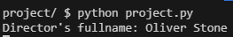
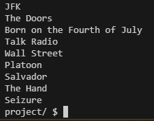
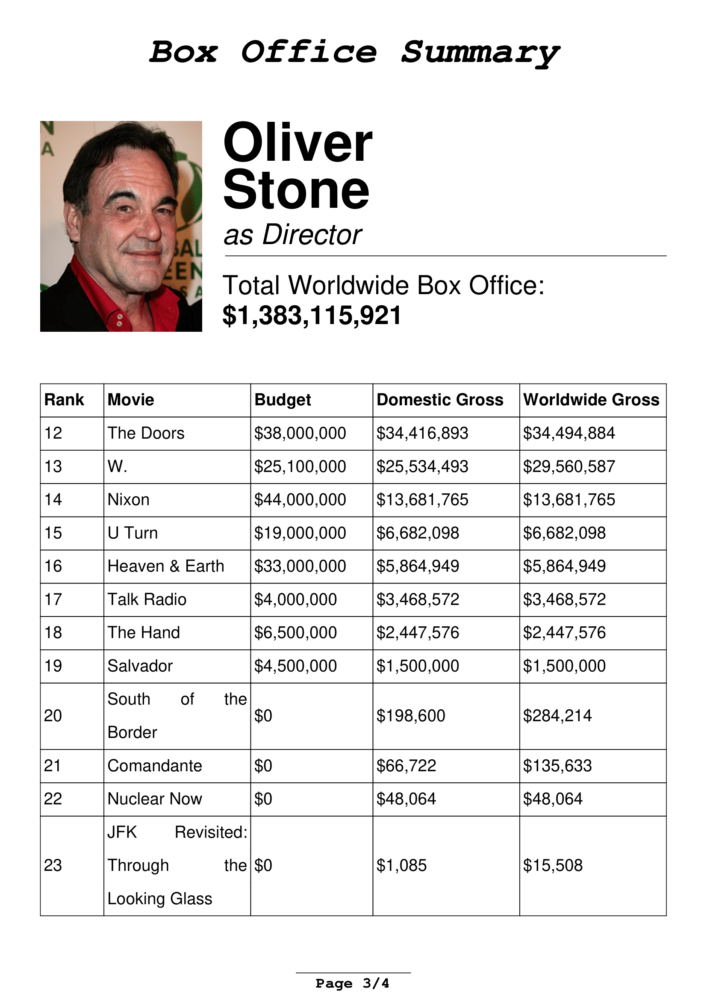
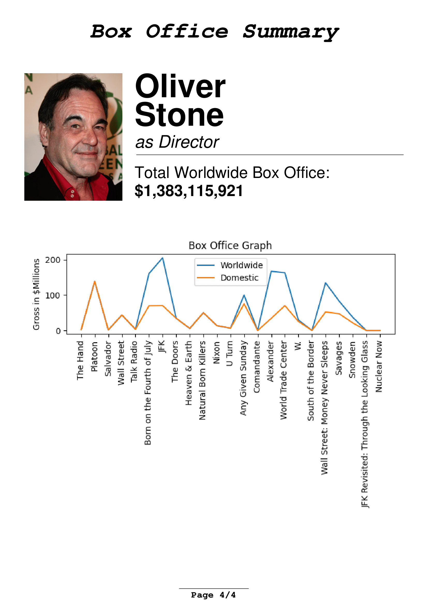

# Director Box Office Summary
#### Video Demo:  <URL HERE>
#### Description:
The IMDb Director Box Office Summary is a Python program that retrieves and compiles box office information for movies directed by a specific director using the IMDb API. The program generates a PDF document containing a summary of the director's box office achievements, top movies, and detailed information about each movie's box office performance

#### Features
- Retrieves director information using the IMDb API.
- Fetches the filmography of the director and filters out released movies.
- Retrieves box office information for each directed movie.
- Generates a PDF document with a summary of the director's box office achievements.
- Includes top movies based on worldwide gross, domestic gross, and domestic opening.


#### Prerequisites
IMDb API Key: You can obtain this key by signing up on the [IMDb API page at RapidApi](https://rapidapi.com/apidojo/api/online-movie-database/).

Libraries: You can install all required libraries by running pip
```
pip install -r requirements.txt
```
#### Usage
Run the program by typing
```
python project.py
```

### Step by step walkthrough:
```
from dotenv import load_dotenv
import requests
import json
import re
from fpdf import FPDF
from PIL import Image
import urllib.request
from fpdf.enums import XPos
import os
```
This section imports the required libraries and packages.\
__dotenv__ for for managing environment variables. In this case for storing API key securely\
__requests__ for retrieving json information via API\
__json__ isn't required but was continiously used for displaying retrieved data whilst debugging\
__re__ for work with regular expressions\
__fpdf__ for creating a pdf\
__PIL__ for work with Image objects\
__urllib.request__ for saving a temporary image from URL\
__fpdf.enums__ for managing x-position of a 'cursor' when printing PDF\
__os__ for loading environment variables and also removing temporary files created in the run of the program

```
load_dotenv('.env')
api_key: str = os.getenv('API_KEY')
```
This code loads environment variables from the .env file, which includs the IMDb API key stored as **API_KEY**

```
class PDF(FPDF):
    ...

```
This section defines a custom **PDF** class that extends **FPDF** from the **fpdf** library. The class is used to customize the appearance of the PDF document that will be generated. It also stores inside the list of all the movies by a certain director and performs operations on it in order to calculate sums of different box office numbers, determine the top movies and sort the movies from the highest grossing to the lowest grossing worldwide.

```
def main():
    ...
```
This is the main block of the program telling it which actions to perform in which order.
```
def make_pdf(director_name, director_image, directed_pics):
    ...
```
The ***make_pdf*** function generates the PDF document with the director's box office summary. It uses the custom PDF class defined earlier to create the document's layout, header, footer, and content.
```
def get_director(name):
    ...
```
The ***get_director*** function fetches information about a director using the IMDb API. It takes the director's name as input, sends a request to the API, and returns the response data in JSON format.
```
def get_movies(id):
    ...
```
The ***get_movies*** function retrieves the filmography of a director using their IMDb ID. It sends a request to the IMDb API and returns the response data, which includes information about movies the director has been involved in.
```
def get_box_office(directed_pics):
    ...
```
The ***get_box_office*** function fetches box office data for movies directed by a director. It takes a list of movies as input, sends requests to the IMDb API for each movie, and extracts box office details such as budget, domestic gross, and worldwide gross. If the data for each of those is missing it pushes 0 as a default value i.e. unknown budget/gross will be represented as 0 and not '-' or 'missing' as it would make later calculations and sortings of movies prone to ValueError
```
def extract_title(string):
    ...
```
The ***extract_title*** function extracts the IMDb ID from a URL. It's used to extract the ID from movie URLs returned by the IMDb API.
```
def return_link_to_croped_image(output_name, height, imageUrl, width):
    ...
```
The ***return_link_to_croped_image*** function processes the director's image, crops it to a specified size, and returns the path to the cropped image.
```
def save_and_pass_from_url(imageUrl, output_name):
    ...
```
The ***save_and_pass_from_url*** function downloads an image from a URL and saves it to a specified file location. It's used for downloading images for processing.
```
def sort_by_year(list):
    ...
```
The ***sort_by_year*** function sorts a list of movies by their release year.
```
def clean_up_temp_files():
    ...
```
The ***clean_up_temp_files*** function removes temporary files generated during the program's execution.
```
if __name__ == "__main__":
    main()
```
This a block of code that ensures that the main function is called if the code is run directly and not as an imported library

### Example run:
Input data:\


Ouput data:\
\
Program prints each film directed by a filmmaker which serves two purposes:
1) helps with finding bugs related to 'corner case films'
2) gives user the sense of program actually doing something and not just stalling before spewing out the pdf

Created file:
\


Here's the pdf:
\


\


\


\



